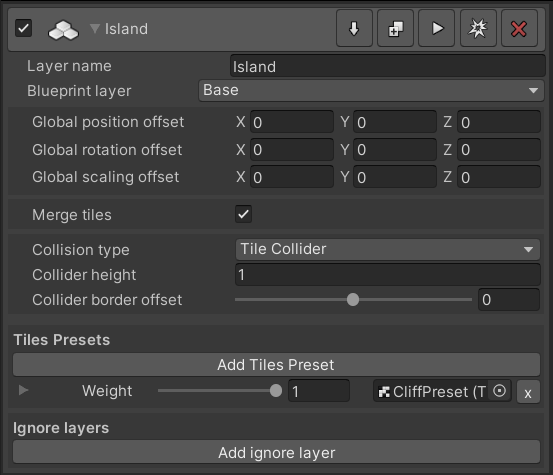

## Build Layers
Build layers are responsible for instantiating prefabs (tiles, objects) based on their assigned blueprint layer. 
There are currently three different build layers:  

+ 3D 4-Tiles
+ 3D 6-Tiles
+ Objects

## 4-Tiles & 6-Tiles build layers  
The build layers takes a TileWorldCreator tile-preset and automatically instantiates the tiles based on the assigned blueprint layer. It also takes care of the correct rotation of the tiles. Depending on how you have exported your tiles from your 3d software you might need to adjust the rotation offset. 

### 4-Tiles  
  
A 4-Tiles build layer uses only four tiles to build a complete map. Therefore tiles needs at least 2 adjacent neighbouring tiles to make sure that the map is completely "closed". This means that the assigned blueprint map will be subdivided and instantiated tiles should be half the size of the cell size.  
> It is recommended to enable `Scale tile by cell size` in the build layer when using a 4 Tiles build layer.  

### 6-Tiles  
  
A 6-Tiles build layer uses six tiles. It can be used for creating path like structures like roads, fences, pipes, rivers etc.  
  

+ `Layer Name`  
  The layer name  
+ `Blueprint Layer`  
  The blueprint layer it should use for instantiation  
+ `Scale tile by cell size`  
  Scale the tile automatically based on the cell size. This works only reliable if your tile prefab has a size of 1x1 units
+ `Global Position offset` `Global scaling offset`  
  Add an additional transform offset to a single tile  
+ `Merge tiles`  
  Merge tiles in to clusters  
+ `Collision type`  
  Select between **None**, **Mesh Collider** and **Tile Collider**  
  + `None` Do not add any collision  
  + `Mesh Collider` Add the exact merged tile mesh as a mesh collider  
  + `Tile Collider` Generate a new mesh collider based on the tiles bounding box.  
    `Collider height` The collider height.  
    `Collider border offset` Add a border offset to the collision mesh, this is sometimes needed if border tiles do not "fill" the whole cell.  
  
+ `Tiles Presets`  
  You can assign multiple tiles preset to a single tiles build layer and set a random weight. This is great if you want to add some variety between tile sets.  
+ `Ignore layers`  
  Ignore layers can be used if you want to skip instantiation for tiles from another blueprint layer which overlaps with the assigned one.  
  **Example:**  
    
Here we have a map which has two blueprint layers `Base` and `Inner`. The `Base`layer generates the ground and the `Inner` layer shrinks the base layer by one tile to create the inner "grass" map. Because of this, we don't want to instantiate the tiles in the `Base` layer which are overlapping with the `Inner` layer. Therefore we assign the `Inner` layer to the ignore layers of the `Cliffs` build layer.  

  
## Build objects layer
  
The build objects layer instantiates single prefabs based on the assigned blueprint layer.  
Can be used for placing trees, props or even enemies or the player character itself.
  
+ `Name`  
  The layer name  
+ `Blueprint layer`  
  The blueprint layer it should use for instantiation  
+ `Use subdivided map`  
If true, objects will be placed similiar to tiles by using the subdivided map. That means for a 1x1 cell it will place 2x2 objects.  
If this is not desired leave it off.  
+ `Position offset` `Rotation offset` `Scale offset`  
  Add an additional transform offset to the object  
+ `Childs`  
  When enabled you can assign an additional child object which will be instantiated in a certain radius around the parent object.  
+ `Random Position` `Random Rotation` `Random Scaling`  
  Modifies the objects transform by random values.  
+ `Merge`  
  Merge the instantiated objects in to clusters.  

## Execute layers

You can either execute each layer separately, the complete blueprint/build stack or all layers together by clicking on the appropriate buttons.
> Hold the Left-CTRL key while clicking on one of these buttons to force a complete rebuild of the map.
