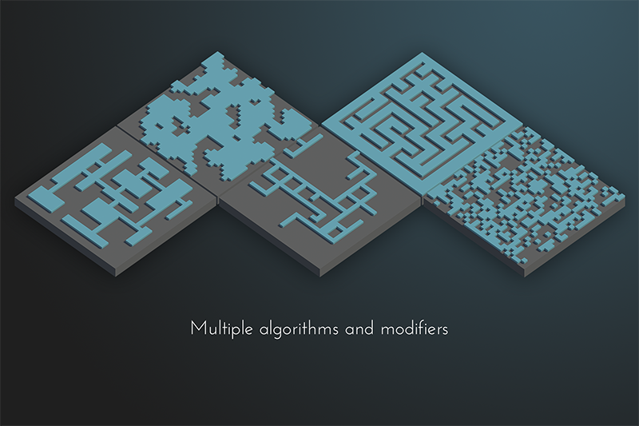
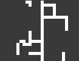
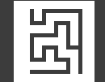
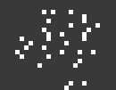
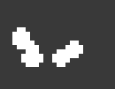
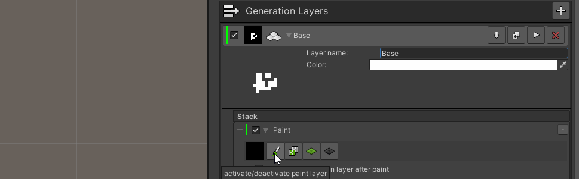
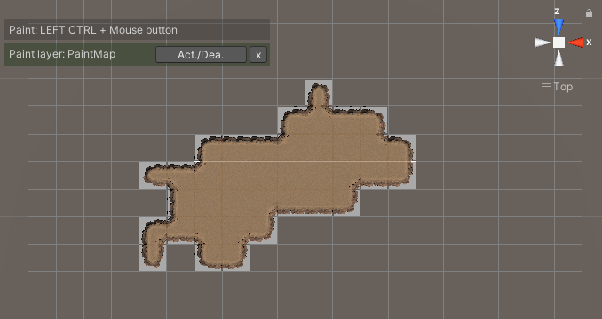

# Generators
  
Generators are actions which creates a map based on an algorithm (Except for the paint generator) from scratch.  
TileWorldCreator has multiple algorithms built-in but you can of course also implement your own.

## Cellular Automata
  
The cellular automata generator is a great generator if you want to create an island type of map.

## BSP Dungeon
  
BSP Dungeon generates dungeon like maps based on the BSP algorithm.

## L-System
  
The L-System generator is great for creating road like networks or similiar looking maps.

More

## Maze
  
Use the maze generator to generate maze like maps.

## Random Noise
  
Generates a random noise map. Great in combination with an `expand` and `smooth` modifier.  
**Random noise with `expand` and `smooth` modifier:**  
  

## Paint
  
The paint generator allows you to easily paint a map in the scene view. 

1. Add a paint generator to your layer. 
2. Enable the paint generator by clicking on the brush icon. 
3. In the scene view you can now start adding or removing tiles by holding Left Ctrl key and holding the left or right mouse button. 
  
4. When enabling the paint layer, the scene view registers the paint layer and allows you to easily enable / disable the paint layer from the scene view. 
