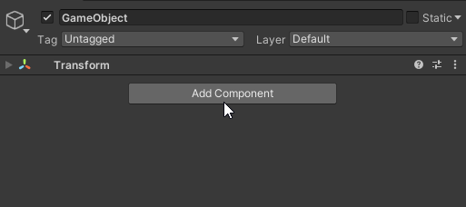
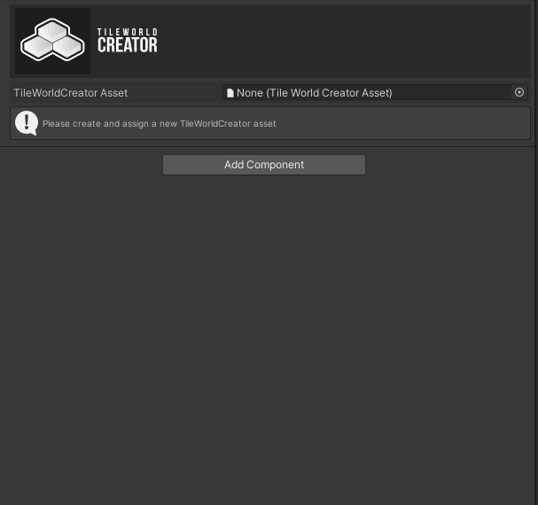
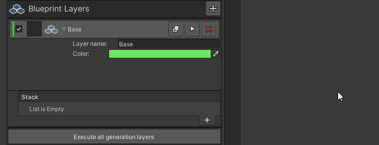
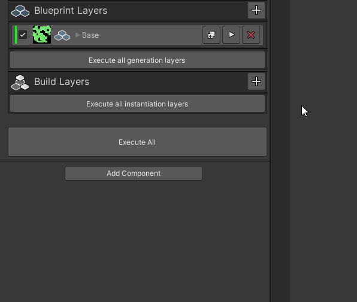
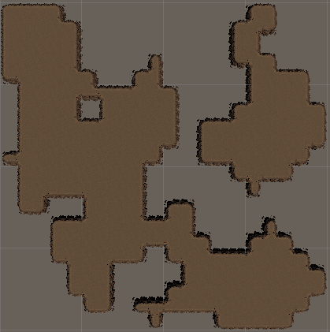

## Installation

Simply import the package from the package manager. You can move the TileWorldCreator folder wherever you want inside of your project.

> TileWorldCreator version 3 is a complete rewrite and is therefore not compatible with saved maps from version 2.
Tiles made for v2 can be reused for version 3.
Version 3 has a completely new and more flexible workflow for creating maps based on different generators and modifiers. This allows you to create and modify maps based on "rules". 

### UPR & HDRP
To make ours and your lives easier, all Tile preset materials are using the built-in RP.  
If you're using URP or HDRP you can simply upgrade those materials in your project by selecting: 
** URP **
`Edit / Render Pipeline / Universal Render Pipeline / Upgrade Project Materials to UniversalRP Materials`
** HDRP **
`Edit / Render Pipeline / HD Render Pipeline / Upgrade Project Materials to HDRP Materials`

## Quick start

> Let's create our first map quickly. We'll skip the details for later.  

### Create new asset
1. First create a `TileWorldCreatorAsset` in your project.
2. Right click in the project window and select: `Create -> TileWorldCreator -> New TileWorldCreator Asset`  
3. Create a new empty scene and add a new GameObject to your scene.  
4. Add the TileWorldCreator component to it.  

### Assign Asset

1. Assign the newly created `TileWorldCreatorAsset` file to the empty slot of the TileWorldCreator component.  
2. Set the map size to 20x20 for example.  
3. Click on the `+` button in the generation layers stack to create a new layer.  

### Add your first generator

1. Select the layer. 
2. Name your layer: `Base` and set a color for the preview texture.  
3. Click on the + button of the layer action stack and select: `Generators / CellularAutomata`  
4. Click on the execute layer button.  
5. Nice, TileWorldCreator has generated your first map.  

### Instantiate tiles
The scene is still quite empty though. Let's instantiate some tiles.  

1. Add an instantiation layer of type `Tiles` to the instantiation stack.  
2. Name it: Island, for example  
3. We now have to assign a generation layer to it. Select the `Base` layer.  
4. Click on `Add Tiles Preset` and assign the cliffs tile preset located in `TileWorldCreator / Tiles / Cliffs`  
5. Click on `Execute all instantiation layers`  
6. Congratulations your map has been built!  
  
  

> Next: Play with different modifiers and tile sets. Also have a look at the demo scenes. 
