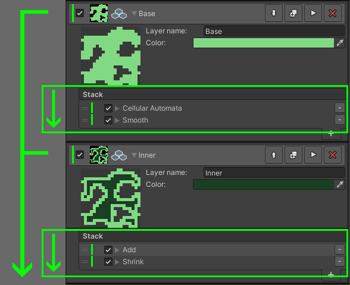

## Installation

Simply import the package from the package manager. You can move the TileWorldCreator folder wherever you want inside of your project.

> TileWorldCreator version 3 is a complete rewrite and is therefore not compatible with saved maps from version 2.
Tiles made for v2 can be reused for version 3.
Version 3 has a completely new and more flexible workflow for creating maps based on different generators and modifiers. This allows you to create and modify maps based on "rules". 

### URP & HDRP
To make ours and your lives easier, all Tile preset materials are using the built-in RP.  
If you're using URP or HDRP you can simply upgrade those materials in your project by selecting:  
* URP  
`Edit / Render Pipeline / Universal Render Pipeline / Upgrade Project Materials to UniversalRP Materials`  
* HDRP  
`Edit / Render Pipeline / HD Render Pipeline / Upgrade Project Materials to HDRP Materials`  

### AOT Platforms
!> API level .Net 4.X is required for all AOT build platforms

## Quick start

> Let's create our first map.  

<iframe width="560" height="315" src="https://www.youtube.com/embed/cscc5_BeY58" title="YouTube video player" frameborder="0" allow="accelerometer; autoplay; clipboard-write; encrypted-media; gyroscope; picture-in-picture" allowfullscreen></iframe>

### Create new asset
1. First create a `TileWorldCreatorAsset` in your project.  
   Right click in the project window and select: `Create -> TileWorldCreator -> New TileWorldCreator Asset`  
2. Create a new empty scene and add a new GameObject to your scene.  
3. Add the TileWorldCreator component to it.  

### Assign Asset

1. Assign the newly created `TileWorldCreatorAsset` file to the empty slot of the TileWorldCreator component.  
2. Set the map size to 20x20 for example.  
3. Click on the `+` button in the blueprint layers stack to create a new layer.  

### Add your first generator

1. Select the new blueprint layer. 
2. Name your layer: `Base` and set a color for the preview texture.  
3. Click on the `+` button of the layer action stack and select: `Generators / CellularAutomata`  
4. Click on the execute layer button.  
5. TileWorldCreator has generated your first map.  

> TileWorldCreator executes all layers and their corresponding action stack from top to bottom.

### Instantiate tiles
The scene is still quite empty though. Let's instantiate some tiles.  

1. Add a build layer of type `3D 4-Tiles` to the build layers stack.  
2. Name it: Island, for example  
3. Let's assign a blueprint layer to it. Select the `Base` layer.  
4. Click on `Add Tiles Preset` and assign the cliffs tile preset located in `TileWorldCreator / Tiles / Version 2 Tiles / CliffIsland`  
5. Click on `Execute all build layers` or on the `Play` button on the layer.  
6. Congratulations your map has been built!  
  
  

> Next: Play with different modifiers and tile sets. Also have a look at the demo scenes. 

## Read more about:
> Blueprint layers [BlueprintLayers](/BlueprintLayers.md)  
> Build layers [BuildLayers](/BuildLayers.md)  
> Tiles preset [TilesPreset](/TilesPreset.md)  
> Merging & Clusters [MergingAndClusters](/MergingAndClusters.md)    
