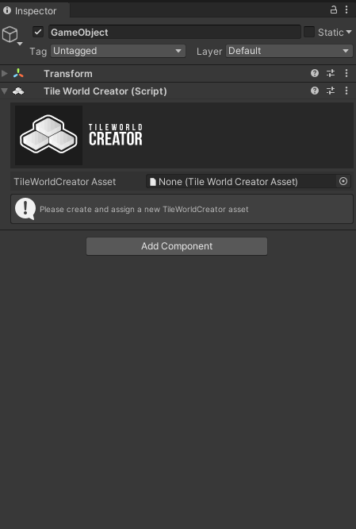
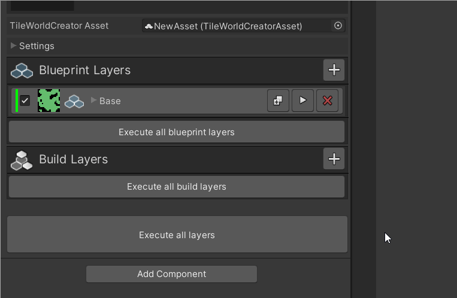

## Installation

Simply import the package from the package manager. You can move the TileWorldCreator folder wherever you want inside of your project.

## Quick start

> Let's create our first map quickly. We'll skip the details first. 

First create a **TileWorldCreatorAsset** in your project.
1. Right click in the project window and select: **Create -> TileWorldCreator -> New TileWorldCreator Asset**  
2. Create a new empty scene and add a new GameObject to your scene.  
3. Add the TileWorldCreator component to it.  
4. Now assign the newly created TileWorldCreator Asset file to the empty slot of the TileWorldCreator component.  

### Add your first generator

1. Click on the + button in the generation layers stack to create a new layer.  
2. Select the layer. 
3. Click on the + button of the layer stack and select: `Generators - CellularAutomata`  
4. Click on the execute layer button  
5. TADA your first generated map  

### Instantiate tiles

1. Add an instantiation layer of type `InstantiateTiles`  to the instantiation stack.  
2. Name it: Island  
3. Select the `Base` layer  
4. Click on `Add Tiles Preset` and assign the cliffs tile preset located in `TileWorldCreator / Tiles / Cliffs`  
5. Click on `Execute all instantiation layers`  
6. Congratulations your map has been built!  
