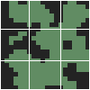
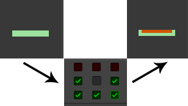

# Modifiers

Modifiers are actions which modify a map.
TileWorldCreator comes with multiple ready to use modifiers but you can also implement your own.

## Add
Add the output of a layer to this layer

## Subtract
Subtract a layer from this layer

## Expand
Expand the tile borders by one tile

## Shrink
Shrink the tile borders by one tile

## Invert
Invert the map

## Offset
Offset the map result by the offset amount  

## Overlap  
Outputs only the overlapping tiles of two blueprint layers  

## Smooth
Smoothes the map by the smoothness amount.  

## PlayerPosition
The PlayerPosition modifier tries to find the best possible place 
to spawn a player. This is done by subdividing the map
in to 9 quadrants and searching for a fill tile in one of these quadrants. 
The output will be one single tile which can then be used by a object instantiation layer to instantiate the player object.  

  

`TopLeft`  
`TopCenter`  
`TopRight`  
`MiddleLeft`  
`MiddleCenter`  
`MiddleRight`  
`BottomLeft`  
`BottomCenter`  
`BottomRight`  

## Select
This is probably the most powerful modifier as it let's you select different parts of your map based on the tiles type or based on rules.
> Combining multiple select modifiers can help extract very specific parts of your map. 

#### Select by rules
When using the rule type you can define multiple "neighbour" rules. This means that the selection modifier checks for each tile if the rule applies to it this tile.  

**Example**  
So for example if you set a rule like this:  
  

This means, only select the tiles which have a neighbour on the left, right, bottom-left, bottom-right and bottom-center.  
So the tile which are orange in the image are being selected now.
