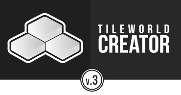

<!-- TODO: Update with your values. -->

### TileWorldCreator documentation

[AssetStore](https://assetstore.unity.com) | 
[Get started](/GettingStarted.md)

> TileWorldCreator version 3 is a complete rewrite and is therefore not compatible with saved maps from version 2.
Tiles made for v2 can be reused for version 3.
Version 3 has a completely new and more flexible workflow for creating maps based on different generators and modifiers. This allows you to create and modify maps based on "rules". 
