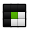

## Tiles preset  
  
Tiles are stored in a separate asset file (scriptable object). This has the advantage of being able to reuse tile presets 
in different TileWorldCreator assets. Depending on what kind of tiles you want to use (4-Tiles or 6-Tiles) you will have to create the appropriate tile-preset type.

  + `Rotation offset` Depending on how your tiles have been created in your 3D software, you will have to add a rotation offset.
  + `Scaling offset` Add a scaling offset to a single tile. Often used when changing the cell size (!=1)

### Create a Tiles Preset
1. Right click in the project view and select `Create / TileWorldCreator / New 3D 4-Tiles preset` or `New 3D 6-Tiles preset`  
2. Assign your tiles based on their type  
 
**4-Tiles**  
+  `Edge`  
+  `Exterior Corner`    
+  `Interior Corner`  
+  `Fill`  
  
**6-Tiles**  
+  `Single`  
+  `Straight`  
+  `Corner`  
+  `Three way`  
+  `Four way`  
+  `Dead end`  
