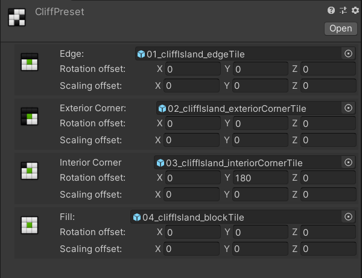
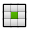

# Concept & Workflow

## Concept
TileWorldCreator only requires four tiles to create beautiful tile maps compared to other autotiling solutions which requires a lot more. 
Therefore it is important to know, how TileWorldCreator handles a map internally.
The generation stack handles a map by its original size but after generation is completed the map needs to be subdivided in order to be able to place the tiles correctly without creating single lost tiles, which would result in unclosed maps. See images below:

  
**Error single tile**

  
**Subdivided map with no error**    

> In the end this means that the size of a final instantiated map will always be two times the size of the width and height. Example: original size: 10x10 = 20x20 in unity units.

## TileWorldCreator component

The TileWorldCreator component is the main component and is responsible for executing the layer stacks.
By referencing the TileWorldCreator component you'll get also access to various runtime methods.

+ `Map width` `Map height`  
  The size of the map
+ `Cell size`  
  The size of a single cell  
+ `Map orientation`  
  The orientation of the map in the world (XZ or XY)  
+ `Use random seed`  
  When enabled you can set a custom random seed which will be used for generating the map  
+ `Merge preview textures`  
  When enabled, the preview thumbnail textures will be merged with the preview texture from the last layer.  
+ `Use custom cluster cell size` 
  Enable this if you want to set a custom cluster size. Normally TileWorldCreator creates the cluster size based on the map size.  
  But it's possible that in some use cases the cluster size might be to large, especially on larger maps.
  Please be aware that the smaller the cluster size is, the longer it'll take to instantiate the tiles and objects.  
  > for more information please refer to [Merging&Clusters](/GettingStarted.md#merging)  

## Generation Layers

TileWorldCreator consists of two different layer stacks. The `Generation layers` stack and the `Instantiation layers` stack. Each layer in the generation layer stack has its proprieate actions stack. These actions are called `generators` (cellular automata, maze, L-System etc.) or `modifiers` (copy, expand, smooth etc.). This let's you easily create different "parts" of your map by using different layers.
TileWorldCreator executes the layers including their generators and modifiers from top to bottom.
So it is always wise to create your `base` map as the first layer and every additional modifications which depends on the `base` layer comes after it.

+ `Layer Name`  
  The actual layer name  
+ `Color`  
  The color which should be used for the preview thumbnail texture  
+ `Stack`  
  The action stack of this specific layer  

### Actions stack  

> Each generation layer executes each action in the action stack from top to bottom.  

  
**Example for a stack:**  
#### Base Layer:

+ `Cellular Automata`  
  Generate a new map with a cellular automata generator
+ `Smooth`  
  Modify the map by smoothing it

#### Inner Layer:

+ `Copy`  
  copy the base map to the inner layer
+ `Shrink`  
  shrink the map by one tile 

## Instantiation Layers
Next we have the instantiation layers stack. These layers are responsible for taking the final output of a generated layer from the generation layers stack and use it to instantiate the tiles or objects.
> Make sure the generation layers stack has been executed first before trying to execute the instantiation layers. 

### Instantiate Tiles
The instantiate tiles layer takes a TileWorldCreator tiles preset and automatically instantiates the tiles based on the assigned layer. It also takes care of the correct rotation of the tiles. Depending on how you have exported your tiles from your 3d software you might need to adjust the rotation offset. 

+ `Layer Name`  
  The layer name  
+ `Assigned Layer`  
  The generated map layer it should use for instantiation  
+ `Global Position offset` `Global scaling offset`  
  Add an additional transform offset to a single tile  
+ `Merge tiles`  
  Merge tiles in to clusters  
+ `Add mesh collider`  
  Add a mesh collider to the merged mesh
+ `Tiles Presets`  
  You can assign multiple tiles preset to a single tiles instantiation layer and set a random weight. This is great if you want to add some variety between tile sets.  
+ `Ignore layers`  
  Ignore layers can be used if you want to skip instantiation for tiles from another generation layer which overlaps with the assigned one.  
  **Example:**  
  
  Here we have a map which has two generation layers `Base` and `Inner`. The `Base`layer generates the ground and the `Inner` layer shrinks the base layer by one tile to create the inner "grass" map. Because of this, we don't want to instantiate the tiles in the `Base` layer which are overlapping with the `Inner` layer. Therefore we assign the `Inner` layer to the ignore layers of the `Cliffs` instantiation layer. 

### Tiles preset
  
Tiles are stored in a separate asset file (scriptable object). This has the advantage of being able to reuse tile presets 
in different TileWorldCreator assets.
#### Create a Tiles Preset
1. Right click in the project view and select `Create / TileWorldCreator / New TileWorldCreator Tiles preset`
2. Assign your tiles based on their type 
+  `Edge`  
+  `Exterior Corner`    
+  `Interior Corner`  
+  `Fill`  

### Instantiate Objects
  
The instantiate objects layer instantiates single prefabs based on the assigned generation layer.
  
+ `Name`  
  The layer name  
+ `Assigned layer`  
  The generation layer it should use for instantiation  
+ `Use subdivided map`  
If true, objects will be placed similiar to tiles by using the subdivided map. That means for a 1x1 cell it will place 2x2 objects.  
If this is not desired leave it off.  
+ `Position offset` `Rotation offset` `Scale offset`  
  Add an additional transform offset to the object  
+ `Childs`  
  When enabled you can assign an additional child object which will be instantiated in a certain radius around the parent object.  
+ `Random Position` `Random Rotation` `Random Scaling`  
  Modifies the objects transform by random values.  
+ `Merge`  
  Merge the instantiated objects in to clusters.  

## Merging & Clusters :id=merging
An instantiation layer takes care of partitioning a map into smaller clusters. Each cluster contains multiple tile objects. When merging is enabled, all tiles inside of a cluster are being merged together.  When changing a map - by painting tiles for example - the instantiation tiles layer checks for all changed tiles in each cluster and updates only the changed cluster. 
> When creating large maps it is highly recommended to enable merging. 

## Execute layers

> You can either execute each layer separately, the complete generation/instantiation stack or all layers together by clicking on the appropriate buttons.
