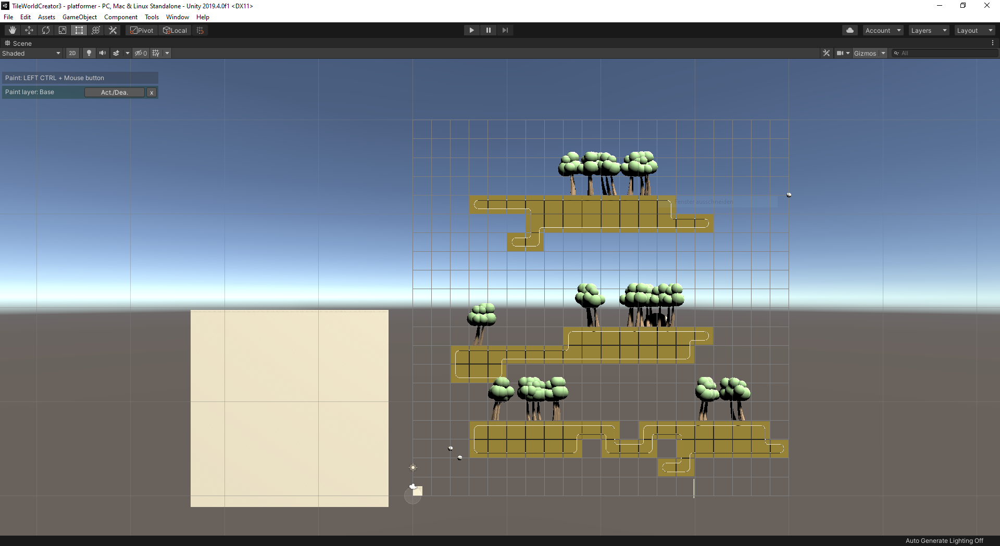

<!-- TODO: Update title -->
<h1 id="cover-heading">
  TileWorldCreator v.3
</h1>

<!--
 <!-- TODO: Update username and repo name -->

> Official documentation <!-- TODO: Replace with your description -->

[Asset-Store](https://assetstore.unity.com/) <!-- TODO: Remove on your copy of this template.-->
[Get Started](#TileWorldCreator-documentation) <!-- TODO: Use ID of your homepage heading -->

<!-- background color -->

<!---->
