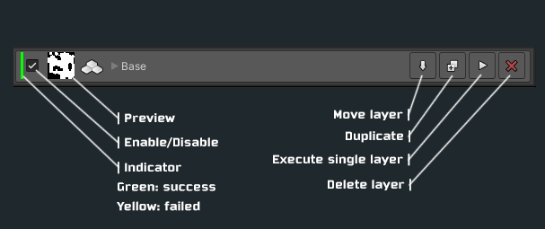

## Blueprint Layers

TileWorldCreator consists of two different layer stacks. The `Blueprint layers` stack and the `Build layers` stack. Each layer in the blueprint layer stack has its own actions stack. These actions are called `generators` (cellular automata, maze, L-System etc.) or `modifiers` (copy, expand, smooth etc.). By combining those actions and layers you can easily "model" your map or create different "parts" from it.
TileWorldCreator executes the layers including their generators and modifiers from top to bottom.
So it is always wise to create your `base` map as the first layer and every additional modifications which depends on the `base` layer comes after it.

+ `Layer Name`  
  The actual layer name  
+ `Color`  
  The color which should be used for the preview thumbnail texture  
+ `Stack`  
  The action stack of this specific layer  

### Actions stack  

> Each blueprint layer executes each action in the action stack from top to bottom.  

  
### Action stack example
#### Base Layer:

+ `Cellular Automata`  
  Generate a new map with a cellular automata generator
+ `Smooth`  
  Modify the map by smoothing it

#### Inner Layer:

+ `Add`  
  Add the base map to the new inner layer
+ `Shrink`  
  shrink the map by one tile 

