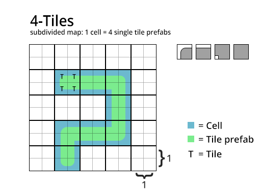

# Update 3.1

This is an important notice regarding the new update 3.1 as it contains possible breaking changes for users using TWC prior to version 3.1.

!> Due to the new 6-Tiles build support and changes with the cell size behavior, it may happen that your map size is now half the size as before. Meaning, it now basically has the correct size in unity units.  
  
## Before (prior to version 3.1)  
Before 3.1: A generated map has always been subdivided to make sure that single cells would not result in "unclosed" maps. A map therefore was always twice the size of the actual map size which has been set in the settings. See image below:  
  

## NEW (version 3.1)
?> A cell size set to 1 meant an actual cell size of 2x2 unity units (because of the subdivision). Since 3.1 this isn't the case anymore. The subdivided map for a 4-Tiles build layer is now the same size as the actual map size set in the settings. A subdivided map now subdivides the cell size as well. Meaning that a single tiles prefab in a 4-Tiles build is now half the size of the actual cell size.  
  
  
   
A 6-Tiles build layer can handle tiles with one or less adjacent tiles. Therefore it doesn't need a subdivided map. 
  
To prevent confusion with the cell size and to support both 4 and 6 Tiles simultaneously the cell size matches the Unity grid and isn't actually double the size now. 
Additionally both 4 and 6-Tiles build layers now have an option to scale the tiles based on the cell size. This only works reliable if your prefab tiles are the size of 1x1 unit. 
  
## What should I do?  
If you encounter that your map size is only half the size as before the update, you can either **set the cell size to: 2**  
Or increase the map size by two and **enable automatic grid size scaling** in the build layers. 
Doing this will change the overall look of the map though. (smaller tiles)

  
## Runtime editor  
Some smaller changes regarding the runtime editor has been made. Basically when modifying a map at runtime, you don't have to divide the cell position by two anymore. 
  
## API  
New 
```csharp
ExecuteAllBuildLayers(string priorityBuildLayerName, bool forceRebuild)  
```  
Setting a build layer as priority will make sure that this build layer will be updated first. This is useful if you want to make sure the response time is as fast as possible. 
The new "Anno" like Demo scene makes use of this feature and sets the currently selected layer as the priority layer. 
